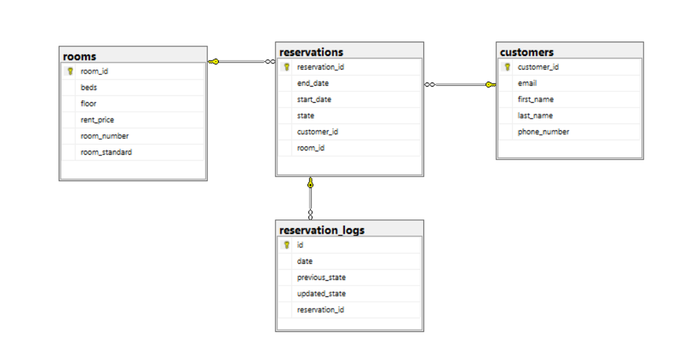

# Hotelpol

Repository for Object-oriented technologies course at AGH UST.

## Topic of the project

Application for managing rooms and hotel reservations.

## Authors

 - Dominik Puz
 - Gracjan Filipek
 - Krzysztof Usnarski

## Technologies

 ### Frontend

  - JavaFX
 ### Backend

  - Java
  - Spring
  - Spring Boot
  - Spring Data

 ### Database

  - MS SQL

## Diagram of database

    