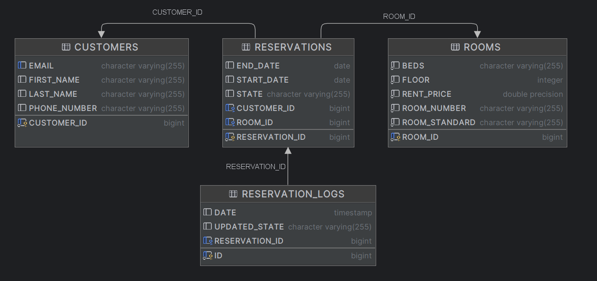
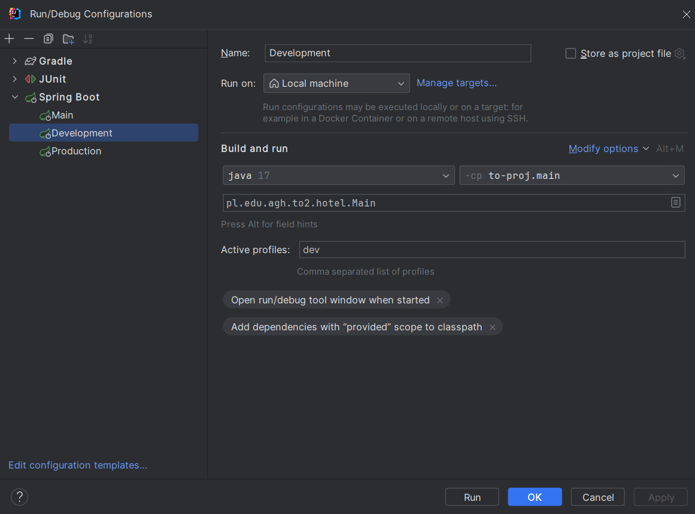
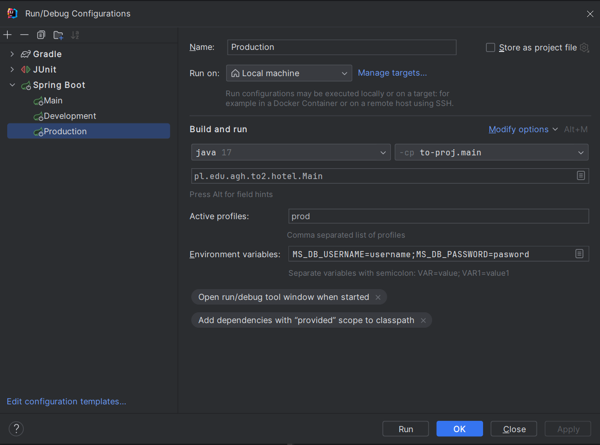

# HotelPol

Repository for Object-oriented technologies course at AGH UST.

## Topic of the project

Application for managing rooms and hotel reservations.

## Authors

 - Dominik Puz
 - Gracjan Filipek
 - Krzysztof Usnarski

## Technologies

 ### Frontend

  - JavaFX

 ### Backend

  - Java
  - Spring
  - Spring Boot
  - Spring Data

 ### Database
  - Microsoft SQL
  - H2 (development and testing purposes)

## Database Diagram

## Milestones

Below we describe layers developed and features added at each milestone.

### Milestone 1

This milestone was all about project setup and persistence layer.

Things we have dealt with:
  - set up the app using SpringBoot and JavaFX frameworks
  - adopted the code-first persistence approach
  - chose H2 and Microsoft SQL databases (as mentioned in the [Technologies section](#technologies))
  - defined ['prod'](#production---prod) and ['dev'](#development---dev) Spring profiles 
  - created persistence models layer (entities)
  - created business / logic models layer
  - defined mapper to map objects between these layers
  - spiced everything up with a hefty amount of unit tests

### Milestone 2

The goal for this milestone was to have a simple but complete data flow
from the persistence layer all the way to the GUI and vice versa.

Features we have introduced:
  - persistence layer
    - new repository methods for database queries
  - simple service layer
    - finding / getting model objects
    - finding by 'important' properties (e.g. end date of a reservation)
    - creating and persisting new objects
    - updating existing objects
  - basic controllers layer
    - managing stages and scenes
    - data overview: simple tables
    - dialogs for:
      - detailed object info
      - creating new objects
      - updating existing objects
  - simple graphical user interface
    - defined scenes (main view, overviews, dialogs) with .fxml files

## How to Run

To run the HotelPol application, follow these steps:

1. Download or clone the repository to your local machine.
2. Import the project into IntelliJ IDEA or your preferred IDE.
3. If asked, set the Java SDK to version 17 or newer in your project settings.
4. Build the application with Gradle.
5. Run the application with an appropriate [Spring profile](#spring-profile).

### Spring profile
HotelPol applications offers two Spring profiles to run:

#### Development - "dev"
Profile used for development purposes. Utilizes a local H2 database filled with sample data.

To run the application with the "dev" profile, follow these steps:
1. Create a Spring Boot Run Configuration in IntelliJ IDEA.
2. Configure the Run Configuration as shown below:

3. Run the configuration.

#### Production -  "prod"
Profile used for production purposes. Connects to an existing Microsoft SQL Server database instance. To run the application in production mode, make sure to:
1. Have access to or provide an existing Microsoft SQL Server database instance.
2. Set up a database profile with a valid username and password, ensuring the user has appropriate permissions for the application.
3. Now, just like with the [development profile](#development---dev), you should create a run configuration as shown below:

4. Finally, you can execute the application with the "prod" profile. It will connect to and use the specified Microsoft SQL Server database.

    